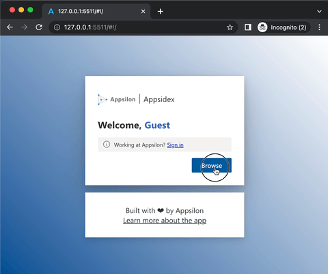

# shiny.router <a href="https://appsilon.github.io/shiny.router/"></a>

> _A minimalistic router for your Shiny apps._

<!-- badges: start -->

[](https://app.codecov.io/gh/Appsilon/shiny.router)
[](https://CRAN.R-project.org/package=shiny.router)
[](https://CRAN.R-project.org/package=shiny.router)
<!-- badges: end -->

Now it's possible to recreate a state of your app, by providing a specific URL, like:

```r
router_ui(
  route("<your_app_url>/main",  mainPageShinyUI),
  route("<your_app_url>/other", otherPageShinyUI)
)
```

<!-- TODO We would like to have a nice graphic explaning routing mechanism -->

## How to install?

It's possible to install this library through CRAN

```r
install.packages("shiny.router")
```

The most recent version you can get from this repo using [remotes](https://github.com/r-lib/remotes).

```r
remotes::install_github("Appsilon/shiny.router")
```

## How to use it?

Basic usage:

```r
library(shiny)
library(shiny.router)

root_page <- div(h2("Root page"))
other_page <- div(h3("Other page"))

ui <- fluidPage(
  title = "Router demo",
  router_ui(
    route("/", root_page),
    route("other", other_page)
  )
)

server <- function(input, output, session) {
  router_server()
}

shinyApp(ui, server)
```

Check [the tutorial](https://appsilon.github.io/shiny.router/articles/basics.html) for more details on how to start using `shiny.router`.

## Examples

An application that showcases the `shiny.router` features can be found [here](https://connect.appsilon.com/appsidex/#!/):

<a href="https://connect.appsilon.com/appsidex/#!/" target="_blank"></a>

It was built using two other Appsilon Open Source packages:

- [`rhino`](https://appsilon.github.io/rhino/) - an R package designed to help building high quality, enterprise-grade Shiny applications at speed.
- [`shiny.fluent`](https://appsilon.github.io/shiny.fluent/) - Microsoft's Fluent UI for Shiny apps.

You can also visit [examples](https://github.com/Appsilon/shiny.router/tree/master/examples) directory for some complete samples.

## How to contribute?

If you want to contribute to this project please submit a regular PR, once you're done with new feature or bug fix.

Reporting a bug is also helpful - please use [GitHub issues](https://github.com/Appsilon/shiny.router/issues) and describe your problem as detailed as possible.

## Appsilon


Appsilon is a **Posit (formerly RStudio) Full Service Certified Partner**.<br/>
Learn more at [appsilon.com](https://appsilon.com).

Get in touch [opensource@appsilon.com](mailto:opensource@appsilon.com)

Explore the [Rhinoverse](https://rhinoverse.dev) - a family of R packages built around [Rhino](https://appsilon.github.io/rhino/)!

<a href = "https://appsilon.com/careers/" target="_blank"></a>
