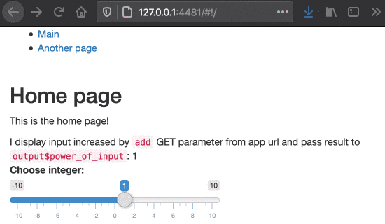

```{r setup, include = FALSE, screenshot.force = FALSE}
library(shiny)
library(shiny.router)
```

In this tutorial we will walk you through the basics of routing with the `shiny.router` library.

In a web application, routing is the process of using URLs to drive the user interface. Routing adds more possibilities and flexibility while building a complex and advanced web application, offering dividing app into separated sections.

Let's build together a simple app that has two subpages and captures the data from url parameters.

We start by importing the packages.

```{r echo = T, include = T, eval = FALSE}
library(shiny)
library(shiny.router)
```

Next, we create the content of our subpages: "home" and "another".

```{r echo = T, include = T, eval = FALSE}
home_page <- div(
  titlePanel("Home page"),
  p("This is the home page!"),
  uiOutput("power_of_input")
)

another_page <- div(
  titlePanel("Another page"),
  p("This is the another page!"),
)
```

Now we can create routing. We provide routing paths, a UI of the page and (optionally) server-side callback for each page (here: `NA`).

```{r echo = T, include = T, eval = FALSE}
router <- make_router(
  route("/", home_page, NA),
  route("another", another_page, NA)
)
```

Optionally, we can create a menu to easier navigate on our webapp:

```{r echo = T, include = T, eval = FALSE}
menu <- tags$ul(
    tags$li(a(class = "item", href = route_link("/"), "Main")),
    tags$li(a(class = "item", href = route_link("another"), "Another page")),
  )
```

Now, we create an output for our router in main UI of Shiny app. We also add `sliderInput` to test its
functionality.

```{r echo = T, include = T, eval = FALSE}
ui <- fluidPage(
  menu,
  tags$hr(),
  router$ui,
  shiny::sliderInput("int", "Choose integer:", -10, 10, 1, 1),
)
```

Then, we plug router into Shiny server (note: `router$server` at the beginning).

```{r echo = T, include = T, eval = FALSE}
server <- function(input, output, session) {
  router$server(input, output, session)
}
```

In theory that would be it, but additionally we can also introduce the mechanism
of catching the parameters from the URL. We will use `get_query_param` function.
Our modified Server code may look like this:

```{r echo = T, include = T, eval = FALSE}
server <- function(input, output, session) {
  router$server(input, output, session)

  component <- reactive({
    if (is.null(get_query_param()$add)) {
      return(0)
    }
    as.numeric(get_query_param()$add)
  })

  output$power_of_input <- renderUI({
    HTML(paste(
      "I display input increased by <code>add</code> GET parameter from app url and pass result to <code>output$power_of_input</code>: ",
      as.numeric(input$int) + component()))
  })
}
```

It's time to run it.

```{r echo = T, include = T, eval = FALSE}
shinyApp(ui, server)
```

Here you can see the final result:



Feel free to copy the code of this example and test it on your own!
