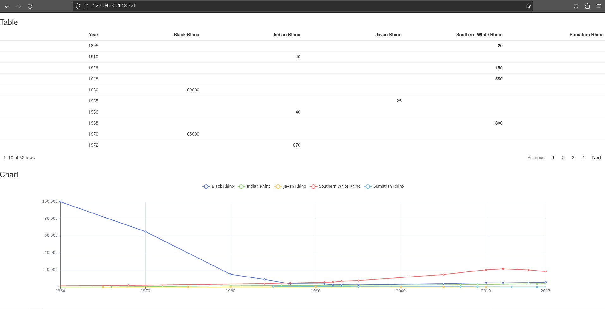
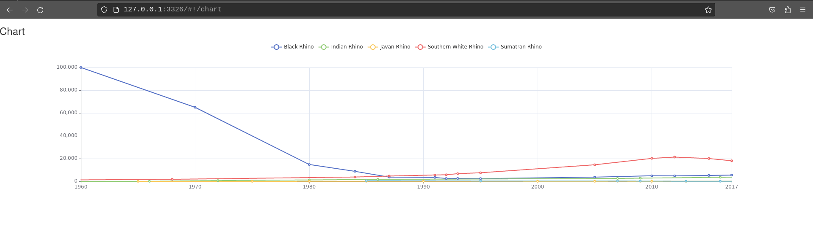
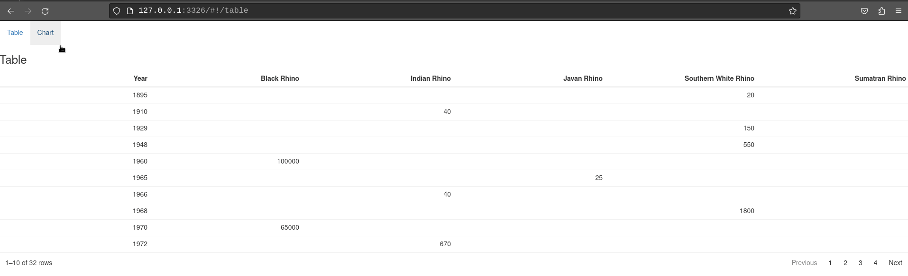
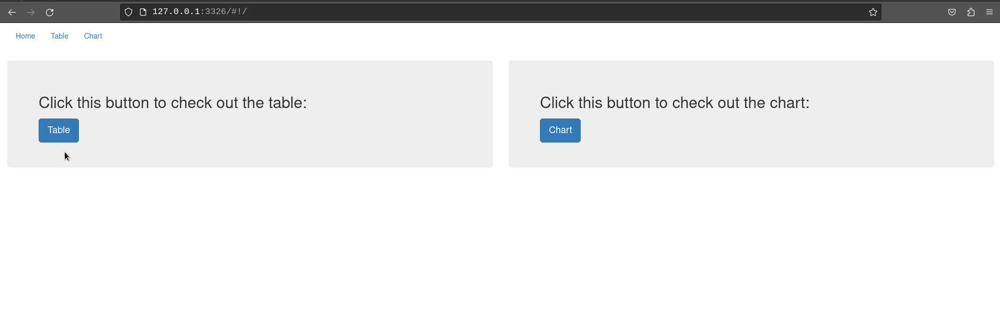
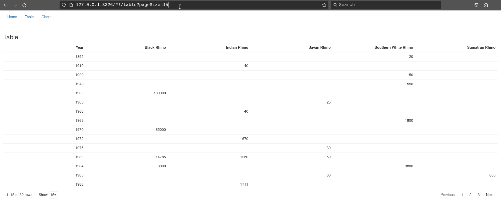
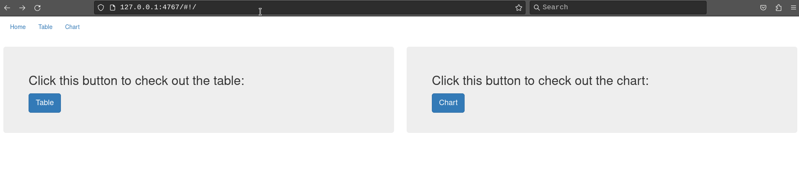

# Introduction

`rhino` is a `shiny` framework focused on building applications with
the best software engineering practices in mind. This tutorial will show you
how you can use `shiny.router` in a Rhino app.

You can read more about `rhino` on the [documentation page](https://appsilon.github.io/rhino/).

# Setup Rhino application

The first step is to create a Rhino application.
Before that, make sure that you have `rhino` installed:

```r
install.packages("rhino")
```

Now, initialize a new Rhino application. You can do it either by using RStudio Wizard
or a function `rhino::init("rhino_router")`.
More details on how to create a Rhino app can be found in the [Rhino tutorial](https://appsilon.github.io/rhino/articles/tutorial/create-your-first-rhino-app.html#create-an-initial-application).

# Add the basic content

To speed things up, we will use a basic version of the Rhino application described in the [Rhino tutorial](https://appsilon.github.io/rhino/articles/tutorial/create-your-first-rhino-app.html).

## Add dependencies

First, we need to add the required dependencies:

1. Install dependencies:

```r
# In the R console
renv::install(c("dplyr", "echarts4r", "htmlwidgets", "reactable", "tidyr"))
```

2. Add dependencies to the `dependencies.R` file:

```r
# dependencies.R

# This file allows packrat (used by rsconnect during deployment) to pick up dependencies.
library(dplyr)
library(echarts4r)
library(htmlwidgets)
library(reactable)
library(rhino)
library(tidyr)
```

3. Update the `renv.lock` file:

```r
# in R console
renv::snapshot()
```

If you want to learn more about dependency management in Rhino,
check [this guide](https://appsilon.github.io/rhino/articles/how-to/manage-r-dependencies.html).

## Add content

Next, we need to fill the application with the content.

In `app/logic` add two files, `chart_utils.R` and `data_transformation.R`:

```r
# app/logic/chart_utils.R

box::use(
  htmlwidgets[JS],
)

#' @export
label_formatter <- JS("(value, index) => value")
```

```r
# app/logic/data_transformation.R

box::use(
  dplyr[arrange],
  tidyr[pivot_wider],
)

#' @export
transform_data <- function(data) {
  pivot_wider(
    data = data,
    names_from = Species,
    values_from = Population
  ) |>
    arrange(Year)
}
```

We will add two views - a chart and a table. In `app/view` add `chart.R` and `table.R` files:

```r
# app/view/chart.R

box::use(
  echarts4r,
  shiny[h3, moduleServer, NS, tagList],
)
box::use(
  app/logic/chart_utils[label_formatter],
)

#' @export
ui <- function(id) {
  ns <- NS(id)

  tagList(
    h3("Chart"),
    echarts4r$echarts4rOutput(ns("chart"))
  )
}

#' @export
server <- function(id, data) {
  moduleServer(id, function(input, output, session) {
    output$chart <- echarts4r$renderEcharts4r(
      data |>
        echarts4r$group_by(Species) |>
        echarts4r$e_chart(x = Year) |>
        echarts4r$e_line(Population) |>
        echarts4r$e_x_axis(
          Year,
          axisLabel = list(
            formatter = label_formatter
          )
        ) |>
        echarts4r$e_tooltip()
    )
  })
}
```

```r
# app/view/table.R

box::use(
  reactable,
  shiny[h3, moduleServer, NS, tagList],
)
box::use(
  app/logic/data_transformation[transform_data],
)

#' @export
ui <- function(id) {
  ns <- NS(id)

  tagList(
    h3("Table"),
    reactable$reactableOutput(ns("table"))
  )
}

#' @export
server <- function(id, data) {
  moduleServer(id, function(input, output, session) {
    output$table <- reactable$renderReactable(
      data |>
        transform_data() |>
        reactable$reactable()
    )
  })
}
```

The last step is to update `app/main.R`:

```r
# app/main.R

box::use(
  shiny[bootstrapPage, moduleServer, NS],
)

box::use(
  app/view/chart,
  app/view/table,
)

#' @export
ui <- function(id) {
  ns <- NS(id)

  bootstrapPage(
    table$ui(ns("table")),
    chart$ui(ns("chart"))
  )
}

#' @export
server <- function(id) {
  moduleServer(id, function(input, output, session) {
    # Datasets are the only case when you need to use :: in `box`.
    # This issue should be solved in the next `box` release.
    data <- rhino::rhinos

    table$server("table", data = data)
    chart$server("chart", data = data)
  })
}
```

Now you can run the application with `shiny::runApp()` (or "Run app" button, if you use RStudio).
You should see something like this:



# Add router

Next, let us move the table and the chart to separate pages using `shiny.router`.

## Install `shiny.router`

First, we need to install it:

```r
# In R console
renv::install("shiny.router")
```

add to `dependencies.R` file:

```r
# dependencies.R

# This file allows packrat (used by rsconnect during deployment) to pick up dependencies.
library(dplyr)
library(echarts4r)
library(htmlwidgets)
library(reactable)
library(rhino)
library(shiny.router)
library(tidyr)
```

and update `renv.lock` file:

```r
# in R console
renv::snapshot()
```

## Add routing

To enable routes in our application we need to modify the `app/main.R` file:

1. Import `shiny.router` functions:

```r
# app/main.R

box::use(
  shiny[bootstrapPage, moduleServer, NS],
  shiny.router[router_ui, router_server, route]
)

...
```
2. Wrap UI modules in `router_ui`:

```r
# app/main.R

box::use(
  shiny[bootstrapPage, moduleServer, NS],
  shiny.router[router_ui, router_server, route]
)

box::use(
  app/view/chart,
  app/view/table,
)

#' @export
ui <- function(id) {
  ns <- NS(id)

  bootstrapPage(
    router_ui(
      route("table", table$ui(ns("table"))),
      route("chart", chart$ui(ns("chart")))
    )
  )
}

...
```

Each module needs to be called inside the `route` function.
The first argument there is the route where the UI will be placed
(so for example now the chart will be available at `{your app url}/chart`).

3. Add `router_server` to the server part of the main module:

```r
# app/main.R

box::use(
  shiny[bootstrapPage, moduleServer, NS],
  shiny.router[router_ui, router_server, route]
)

box::use(
  app/view/chart,
  app/view/table,
)

#' @export
ui <- function(id) {
  ns <- NS(id)

  bootstrapPage(
    router_ui(
      route("table", table$ui(ns("table"))),
      route("chart", chart$ui(ns("chart")))
    )
  )
}

#' @export
server <- function(id) {
  moduleServer(id, function(input, output, session) {
    router_server("table")

    # Datasets are the only case when you need to use :: in `box`.
    # This issue should be solved in the next `box` release.
    data <- rhino::rhinos

    table$server("table", data = data)
    chart$server("chart", data = data)
  })
}
```

An important thing to mention here is that we had to provide the default route ("table") that will be
displayed once someone opens the application.

Now, when you run the application, you will see only the table.
To check the chart, you need to change the URL and replace "table" with "chart":



# Change pages from UI

Using only the URL to change the view does not seem to be the easiest way,
so we need to add navigation. To avoid reinventing the wheel, we will utilize
[Bootstrap](https://getbootstrap.com/docs/3.3/) CSS classes available in `shiny`.

Let's add a navbar with two links - one for each view:

1. Import required functions from `shiny` and `shiny.router`:

```r
# app/main.R

box::use(
  shiny[a, bootstrapPage, moduleServer, tags, NS],
  shiny.router[router_ui, router_server, route, route_link],
)

...
```

2. Add navbar:

```r
# app/main.R

box::use(
  shiny[a, bootstrapPage, moduleServer, tags, NS],
  shiny.router[router_ui, router_server, route, route_link],
)

box::use(
  app/view/chart,
  app/view/table,
)

#' @export
ui <- function(id) {
  ns <- NS(id)

  bootstrapPage(
    tags$nav(
      class = "navbar",
      tags$ul(
        class = "nav navbar-nav",
        tags$li(
          a("Table", href = route_link("table"))
        ),
        tags$li(
          a("Chart", href = route_link("chart"))
        )
      )
    ),
    router_ui(
      route("table", table$ui(ns("table"))),
      route("chart", chart$ui(ns("chart")))
    )
  )
}

...
```

Now, the `route_link` function will build the links to our views.
A user can simply click the button in the navbar and it will open a table or chart:



# Change pages from the server

The displayed page can be also changed from the server part of the application.
To demonstrate that, we will add another page
- an introduction with buttons that will move the user to either chart or table page.

First, create `intro.R` file in `app/view` directory.
We will start with adding a UI - two Bootstrap jumbotrons with some descriptions and
buttons:

```r
# app/view/intro.R

box::use(
  shiny[actionButton, column, div, fluidRow, h2, moduleServer, NS, observeEvent],
)

#' @export
ui <- function(id) {
  ns <- NS(id)
  fluidRow(
    column(
      width = 6,
      div(
        class = "jumbotron",
        h2("Click this button to check out the table:"),
        actionButton(
          inputId = ns("go_to_table"),
          label = "Table",
          class = "btn-primary btn-lg"
        )
      )
    ),
    column(
      width = 6,
      div(
        class = "jumbotron",
        h2("Click this button to check out the chart:"),
        actionButton(
          inputId = ns("go_to_chart"),
          label = "Chart",
          class = "btn-primary btn-lg"
        )
      )
    )
  )
}
```

A new view has to be added to our application - modify `app/main.R`:

```r
# app/main.R

box::use(
  shiny[a, fluidPage, moduleServer, tags, NS],
  shiny.router[router_ui, router_server, route, route_link],
)

box::use(
  app/view/intro,
  app/view/chart,
  app/view/table,
)

#' @export
ui <- function(id) {
  ns <- NS(id)

  fluidPage(
    tags$nav(
      class = "navbar",
      tags$ul(
        class = "nav navbar-nav",
        tags$li(
          a("Home", href = route_link("/"))
        ),
        tags$li(
          a("Table", href = route_link("table"))
        ),
        tags$li(
          a("Chart", href = route_link("chart"))
        )
      )
    ),
    router_ui(
      route("/", intro$ui(ns("intro"))),
      route("table", table$ui(ns("table"))),
      route("chart", chart$ui(ns("chart")))
    )
  )
}

#' @export
server <- function(id) {
  moduleServer(id, function(input, output, session) {
    router_server("/")

    # Datasets are the only case when you need to use :: in `box`.
    # This issue should be solved in the next `box` release.
    data <- rhino::rhinos

    intro$server("intro")
    table$server("table", data = data)
    chart$server("chart", data = data)
  })
}
```

You might have noticed that we have changed the argument passed to the `router_server` function.
Now our default page will be just the application URL. In fact, we could omit this argument,
since`"/"` is the default value there.

Now, we need to add logic for changing the page on button click:

```r
# app/view/intro.R

box::use(
  shiny[actionButton, column, div, fluidRow, h2, moduleServer, NS, observeEvent],
  shiny.router[change_page],
)

#' @export
ui <- function(id) {
  ns <- NS(id)
  fluidRow(
    column(
      width = 6,
      div(
        class = "jumbotron",
        h2("Click this button to check out the table:"),
        actionButton(
          inputId = ns("go_to_table"),
          label = "Table",
          class = "btn-primary btn-lg"
        )
      )
    ),
    column(
      width = 6,
      div(
        class = "jumbotron",
        h2("Click this button to check out the chart:"),
        actionButton(
          inputId = ns("go_to_chart"),
          label = "Chart",
          class = "btn-primary btn-lg"
        )
      )
    )
  )
}

#' @export
server <- function(id) {
  moduleServer(id, function(input, output, session) {
    observeEvent(input$go_to_table, {
      change_page("table")
    })

    observeEvent(input$go_to_chart, {
      change_page("chart")
    })
  })
}
```

We used the `change_page` function to change the URL and as a consequence, the displayed view.

Now, your application should behave like that:



# Query parameters

Another feature of `shiny.router` that can be used in our example is the ability to read
query parameters from the URL. We will demonstrate this by showing how you can control
the number of rows displayed in the table.

## Read query parameter

We will start by adding an ability to read the `pageSize` parameter, which will change
the number of displayed rows (so for example opening URL: `{your app url}/table?pageSize=12`)
will show a table with 12 rows).

Modify `app/view/table.R`:

```r
# app/view/table.R

box::use(
  reactable,
  shiny[h3, moduleServer, NS, observeEvent, reactive, req, tagList],
  shiny.router[get_query_param],
)
box::use(
  app/logic/data_transformation[transform_data],
)

#' @export
ui <- function(id) {
  ns <- NS(id)

  tagList(
    h3("Table"),
    reactable$reactableOutput(ns("table"))
  )
}

#' @export
server <- function(id, data) {
  moduleServer(id, function(input, output, session) {
    ns <- session$ns

    page_size <- reactive({
      page_size <- get_query_param("pageSize")

      if (is.null(page_size)) {
        page_size <- 10
      }

      as.numeric(page_size)
    })

    output$table <- reactable$renderReactable({
      data |>
        transform_data() |>
        reactable$reactable(
          defaultPageSize = page_size()
        )
    })
  })
}

```

`get_query_param` reads the query parameters from an URL.
The value is then passed to the table to set the number of rows.
If the param is not set, it will display 10 rows.

## Update query parameter

Let's implement the opposite feature - we will add a page size dropdown to the table
and update the query parameter according to its value.

First, add the page size option to the table:

```r
# app/view/table.R

box::use(
  reactable,
  shiny[h3, moduleServer, NS, reactive, req, tagList],
  shiny.router[get_query_param],
)

box::use(
  app/logic/data_transformation[transform_data],
)

#' @export
ui <- function(id) {
  ns <- NS(id)

  tagList(
    h3("Table"),
    reactable$reactableOutput(ns("table"))
  )
}

#' @export
server <- function(id, data) {
  moduleServer(id, function(input, output, session) {
    ns <- session$ns

    page_size <- reactive({
      page_size <- get_query_param("pageSize")

      if (is.null(page_size)) {
        page_size <- 10
      }

      as.numeric(page_size)
    })

    output$table <- reactable$renderReactable({
      data |>
        transform_data() |>
        reactable$reactable(
          defaultPageSize = page_size(),
          showPageSizeOptions = TRUE,
          pageSizeOptions = c(5, 10, 15, 20, page_size()) |>
            unique() |>
            sort()
        )
    })
  })
}
```

Now you can change the page size using the table dropdown, but it still does not update the query parameter.
To achieve that, we need to add one more element:

```r
# app/view/table.R

box::use(
  reactable,
  shiny[h3, moduleServer, NS, observeEvent, reactive, req, tagList],
  shiny.router[change_page, get_query_param],
)

box::use(
  app/logic/data_transformation[transform_data],
)

#' @export
ui <- function(id) {
  ns <- NS(id)

  tagList(
    h3("Table"),
    reactable$reactableOutput(ns("table"))
  )
}

#' @export
server <- function(id, data) {
  moduleServer(id, function(input, output, session) {
    ns <- session$ns

    page_size <- reactive({
      page_size <- get_query_param("pageSize")

      if (is.null(page_size)) {
        page_size <- 10
      }

      as.numeric(page_size)
    })

    output$table <- reactable$renderReactable({
      data |>
        transform_data() |>
        reactable$reactable(
          defaultPageSize = page_size(),
          showPageSizeOptions = TRUE,
          pageSizeOptions = c(5, 10, 15, 20, page_size()) |>
            unique() |>
            sort()
        )
    })

    observeEvent(reactable$getReactableState("table", "pageSize"), {
      table_page_size <- reactable$getReactableState("table", "pageSize")

      if (table_page_size != page_size()) {
        change_page(paste0("table?pageSize=", table_page_size))
      }
    })
  })
}
```

This way changing the page size will modify the displayed query parameter:



# 404 page

As the final step, we will show how to handle a situation, when a user
tries to open a wrong URL. `shiny.router` comes with a default 404 page that will
be displayed in such case, but you can easily replace it with a custom one.

We will build a new page, with a message and a button that will move the user
back to the home page of the application.

Create a new file called `page_404.R` in the `app/view` directory:

```r
# app/view/page_404.R

box::use(
  shiny[a, div, h1, moduleServer, NS],
  shiny.router[route_link],
)

#' @export
ui <- function(id) {
  ns <- NS(id)

  div(
    h1("Whoops! Something went wrong!"),
    a("Back to home page", href = route_link("/"), class = "btn btn-primary btn-lg")
  )
}

```

Now, we need to add this custom view to the router as the 404 page:

```r
# app/main.R

box::use(
  shiny[a, fluidPage, moduleServer, tags, NS],
  shiny.router[router_ui, router_server, route, route_link],
)
box::use(
  app/view/intro,
  app/view/chart,
  app/view/table,
  app/view/page_404,
)

#' @export
ui <- function(id) {
  ns <- NS(id)

  fluidPage(
    tags$nav(
      class = "navbar",
      tags$ul(
        class = "nav navbar-nav",
        tags$li(
          a("Home", href = route_link("/"))
        ),
        tags$li(
          a("Table", href = route_link("table"))
        ),
        tags$li(
          a("Chart", href = route_link("chart"))
        )
      )
    ),
    router_ui(
      route("/", intro$ui(ns("intro"))),
      route("table", table$ui(ns("table"))),
      route("chart", chart$ui(ns("chart"))),
      page_404 = page_404$ui(ns("page_404"))
    )
  )
}

...
```

And that's it. If you run the application and try to go to a non-existing route,
you should see something similar to this:



----

__Congratulations! You have succesfully upgraded your Rhino application with routing!__
